## **Table of contents**

* [Overview](#overview)
* [Team](#team-and-organization)
* [Page List](#page-list)
* [Mockups](#mockups)
* [Development Timeline](#development-timeline)

## **Overview**
To facilitate student connection, we introduce **Manoa Connect**, a social networking website that applies matching functionalities reminiscent of dating apps (_Tinder_, _Hinge_, etc.) but in the context of finding friends on the UH Manoa campus.

The motivation for this website are derived from the following:

* Despite 20,000 students on the UH Manoa campus, some students have a hard time making friends outside of their (ongoing/previous) classes or majors for various reasons
  * Difficulties being in a foreign environment (_i.e. incoming freshmen, sophomores, exchange students_)
  * Difficulty breaking into established social groups (_i.e. juniors/seniors_)
  * Lack of time to committing to social events
  * General social inexperience/introverted nature
* Developing friendships with people from different majors at UH Manoa provide new perspectives
* New career/networking opportunities can arise from students in different fields of study
* Learning how to socialize with people who have unique backgrounds nurtures social skills applicable throughout life

## **Team and Roles**

Manoa Connect is designed, implemented, and maintained by [Codie Nakamura](http://codie-n.github.io/), [Chaezen-Lee Pebria](https://chaezenp.github.io/), [Masaki Sakai](https://masaki-sk.github.io/), and [Aaron Ramos](https://aar0m.github.io/).

### **Chaezen Pebria - Page Specialist**
Develops design for certain pages and page-specific features.
- “Matching/Connect” page
- Settings page

### **Masaki Sakai - Page Specialist**
Develops design for certain pages and page-specific features.
- Friends page
- Chat page

### **Codie Nakamura - Project Manager**
Tracks team actions on GitHub; develops design for pages and specific features.
- GitHub
- User home page
- User profile

### **Aaron Ramos - Project Manager, Gopher **
Coordinate team and project direction; help others with design/code/testing.
- Landing page
- Login/Signup page
- Graphics

## **Tools and Organization**
**Meeting Time:** Sunday 6PM Discord + Tuesday in-class

**Discord Text Channels**
- Communication
- Links - _important documents/links (i.e. proposal, sheets tracking, GitHub)_
- Assets - _Preliminary assets for everyone to review and look at_

Big Picture Presentation: [Google Slides](https://docs.google.com/presentation/d/1SNOkvmU1mH7Ymwontio2Z7-_S7rfsOa7PxnWv8czc8g/edit?usp=sharing)

## **Page List**

This section provides a set of pages for Manoa Connect that will be implemented.

* [Landing page](#landing-page)
* [Login/signup page](#loginsignup)
* [User home page](#user-home-page)
* [User profile page](#user-profile-page)
* [“Matching/Connect” page](#matchingconnect-page)
* [Friends list and chat page](#friends-list-and-chat-page)
* [Settings page](#settings-page)

**User Profile:** Add/edit name, photo(s), major, likes/interests, list of (previous/current) classes, dorm/commuter/other status, clubs, MBTI

**Matching/Connect:** Random person pops up and users have the option of “match” or “skip” with two buttons

**Friends:** _(Now combined with chat)_ Add freinds to a favorites/block list that can also be accessed; this page also includes the feature to delete friends

**Chat:** _(Now combined with friends)_ List of chats with people matched and a selected chat page that allows for message functioning

**Settings:** Settings to filter people shown (i.e. by major, interests, etc.)

## **Mockups**

### **Landing Page**
- Links to join now page

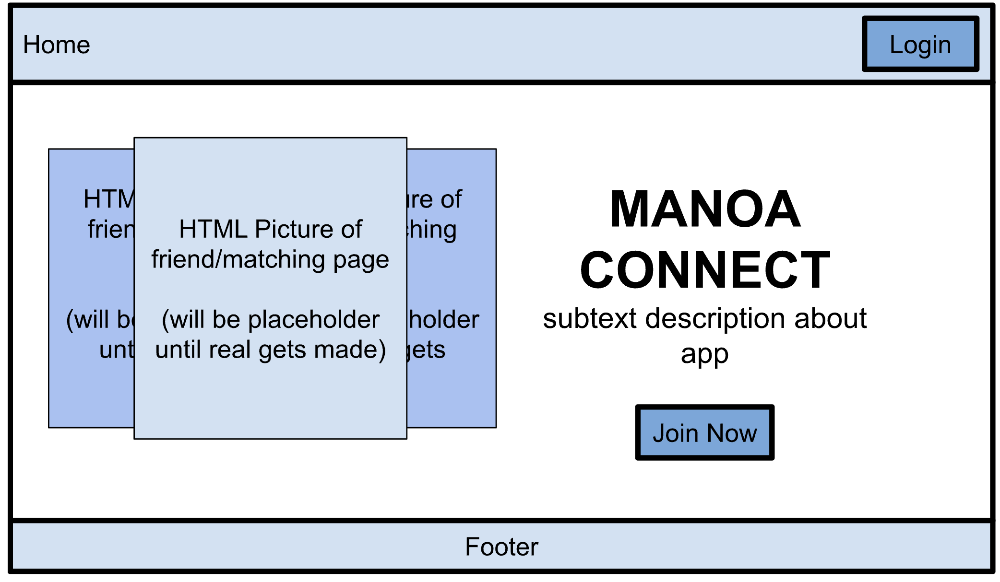

### **Login/Signup**

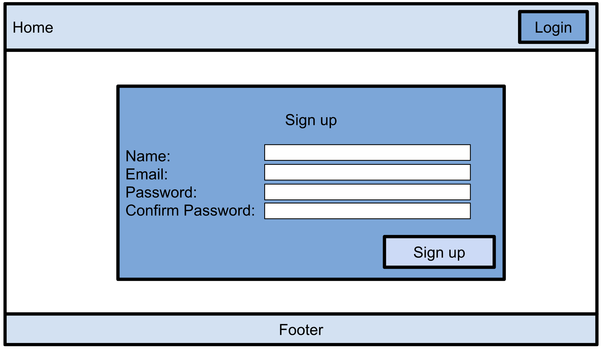

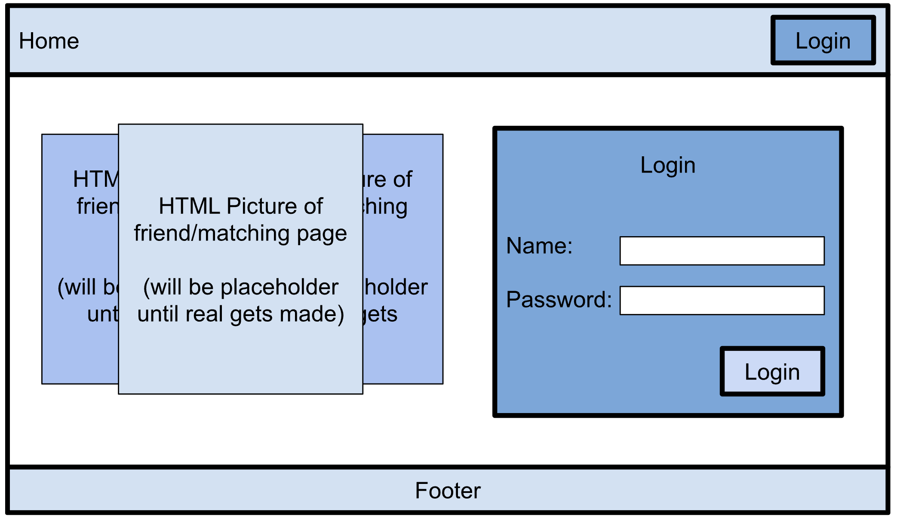

### **User Home Page**
- New messages box will be a button leading to the chat page
- There is second connect button (besides the one in the navbar) to go to the matching page

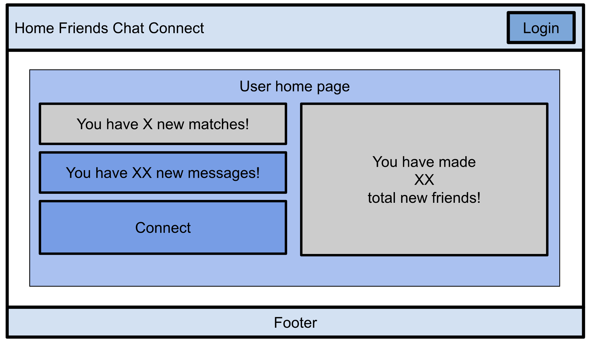

### **User Profile Page**
- **Dropdown:** Major, Year, Commuter status, MBTI
- **Textboxes:** List of current and previous classes, clubs, likes/interests
- Scroll down to upload/edit photos

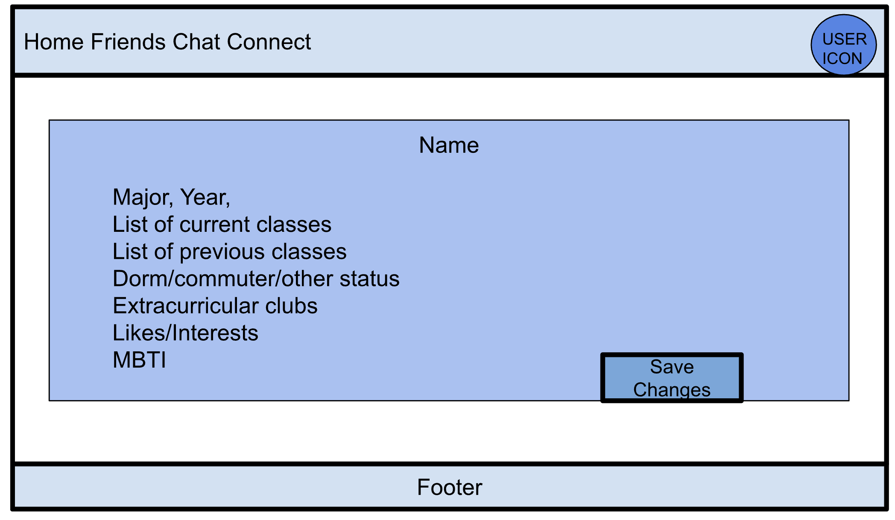

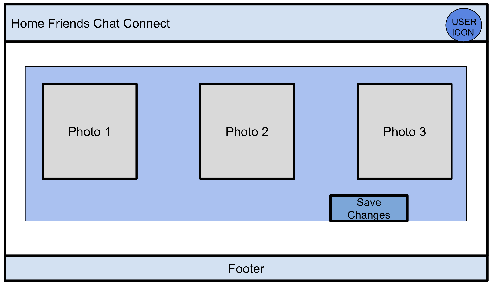

### **“Matching/Connect” Page**
- Manoa ID-inspired layout (flips from front to back on button press)
- Contact object
  - Name
  -  Photo(s) - _limit to 3_
  -  Major
  -  Likes/interests
  -  List of (previous/current) classes
  -  Dorm/commuter/other status
  -  Extracurricular clubs
  -  MBTI

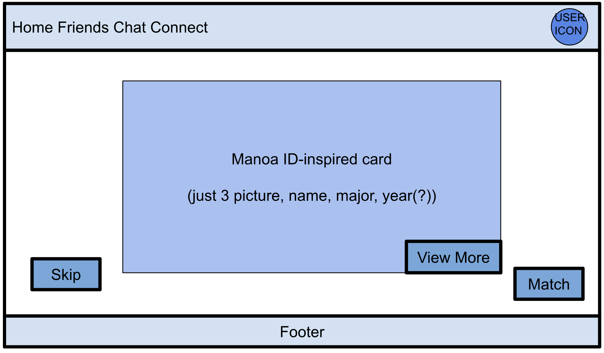

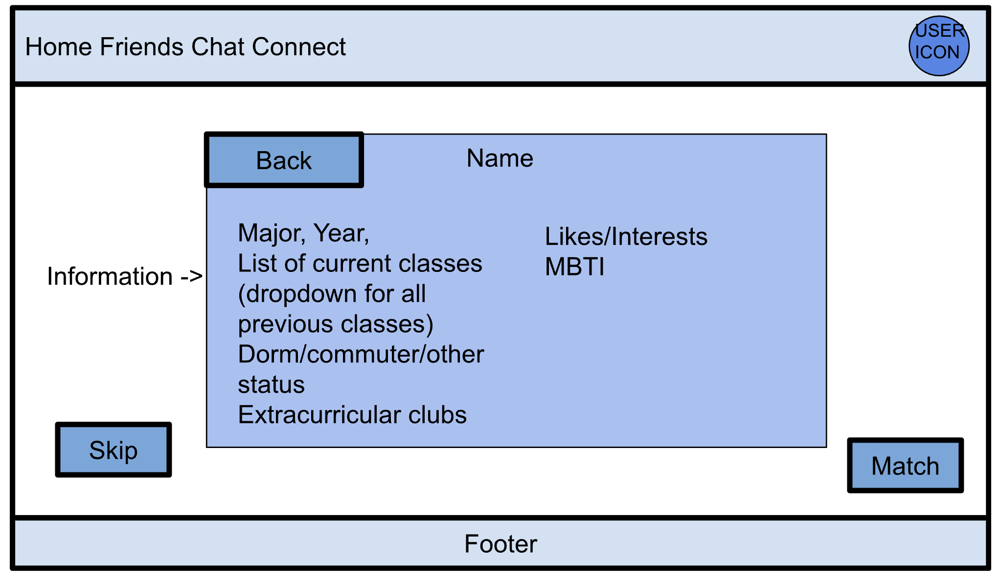

### **Settings Page**
- Access from profile page/dropdown from top right corner
- Scrollable 
- Test 
- Mostly dropdowns
- Some text boxes

### **Friends List and Chat Page**
- Chat implemented using note and timestamp function
- Last conversation is the order of list
- Sort the chat box by the most recent conversation
- Default page is blank, just contacts
  - Clicking on the icon box will open the chat box
- Deleting is like blocking because we will not reconnect the same people again
  - It shows caution window to delete someone

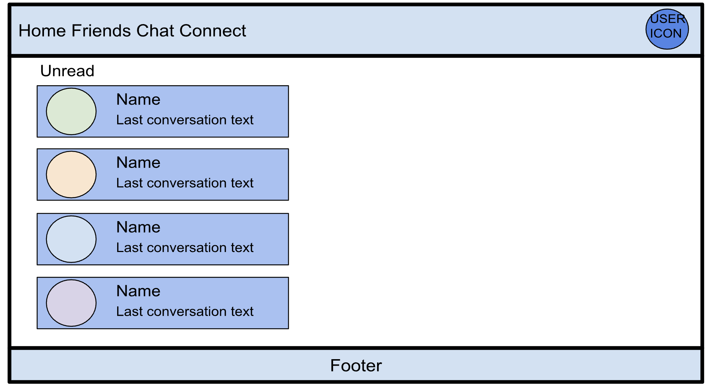

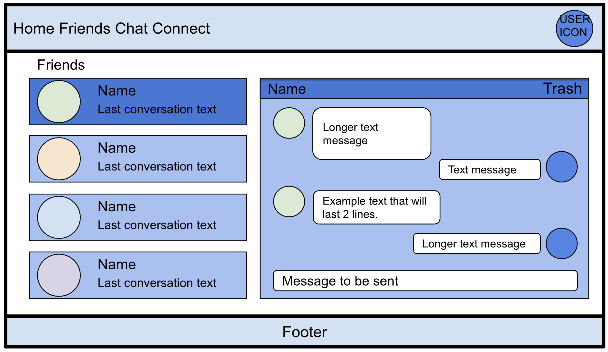

## **Development Timeline**
- [Milestone 1](#milestone-1-m1)
- [Milestone 2](#milestone-2-m2)
- [Milestone 3](#milestone-3-m3)

### **Milestone 1 (M1)**

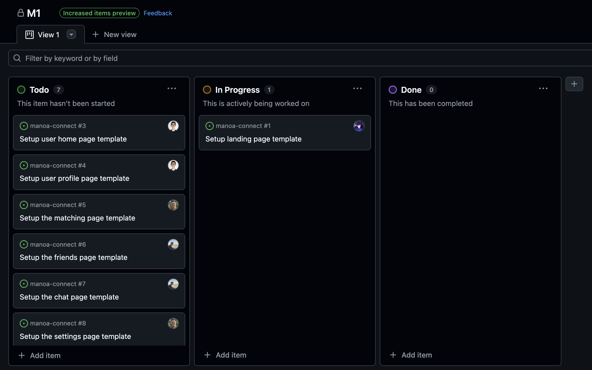

- Completed landing Page
- Templates mockups of other pages in NextJS
- Setup GitHub issues and GitHub project
- Project home page

### **Milestone 2 (M2)**
_TBA_

### **Milestone 3 (M3)**
_TBA_
