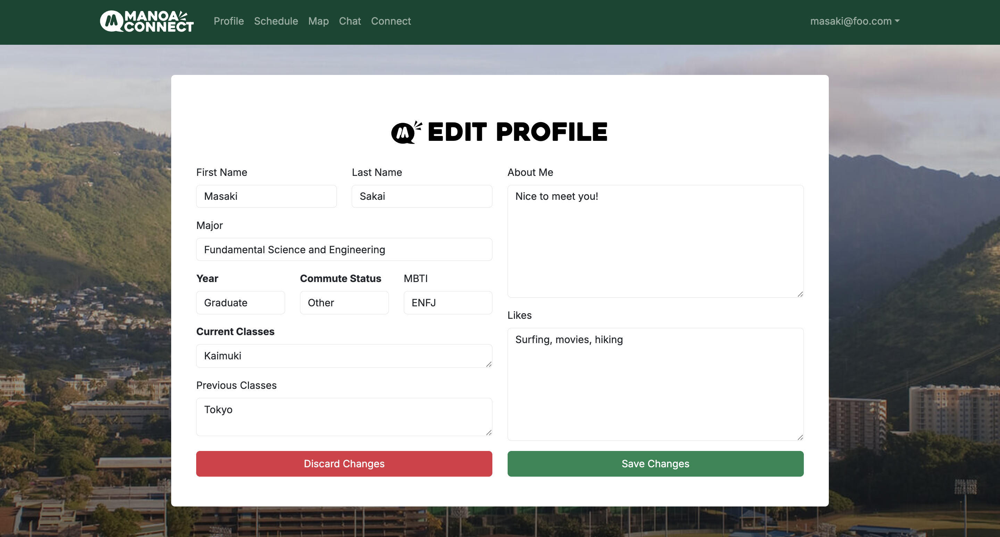

## **Table of contents**
* [Overview](#overview)
* [User Guide](#user-guide)
* [Developer Guide](#developer-guide)

### **Development Process**
* [Team](#team-and-roles)
* [Deployment](#deployment)
* [Page List](#page-list)
* [Mockups](#mockups)
* [Development Timeline](#development-timeline)

[Link](https://github.com/manoa-connect) to GitHub page.
[Link](https://manoa-connect-now.vercel.app/) to Manoa Connect deployed on Vercel.


## **Overview**
To facilitate student connection, we introduce **Manoa Connect**, a social networking website that applies matching functionalities reminiscent of dating apps (_Tinder_, _Hinge_, etc.) but in the context of finding friends on the UH Manoa campus.

### **Motivation**
* Despite 20,000 students on the UH Manoa campus, some students have a hard time making friends outside of their (ongoing/previous) classes or majors
  * Difficulties being in a foreign environment (_i.e. incoming freshmen, sophomores, exchange students_)
  * Difficulty breaking into established social groups (_i.e. juniors/seniors_)
* Some students lack time to commit to social events
* Certain people may be socially inexperience/have an introverted nature
* Pandemic times may have shifted cultural norms on offline socialization (_i.e. people may prefer socializing online more now_)

### **Goal**
Our "Big Picture" vision is to develop a thriving social platform distinct to members of UH Manoa (specifically students). Our ideal outcomes for students include:

* Developing friendships with people from different majors at UH Manoa provide new perspectives
* New career/networking opportunities can arise from students in different fields of study
* Learning how to socialize with people who have unique backgrounds nurtures social skills applicable throughout life


## **User Guide**
This portion covers how users can use a live version of our app deployed on Vercel, found [here](https://manoa-connect-now.vercel.app/), and will assume the user has no prior knowledge of Manoa Connect. After clicking the link, users will be greeted by a landing page and additional information about how the core functionalities of Manoa Connect. If interested, the user can either click on 'Get Started' within the hero banner of the website, or click 'Login' on the top-right corner, which will open a dropdown that makes the 'Sign Up' link available.


### **Create an Account**
Users with an existing account can choose to log in with their credentials by navigating to the bottom of the sign-up page, or clicking in the top-right corner. However, new users should fill out their information on the following sign-up form. Once completed, this will direct the user to the next step of the account creation process: making a profile.


### **Make Your Profile**
Upon signing up, users can now create their own profile by filling out the form. This profile will also be shown to other users looking to connect in a separate page. The form asks for surface-level information that will help find connections based on compatible schedules, interests, likes, and majors.


### **View Your Profile**
Users are then directed to their profile homepage (to be completed), which will include their current profile information and relevant notifications (i.e. possible connections, outgoing connections, total friends, and new messages). There are also quick links to other pages of the website if users wish to explore.


### **Edit Your Profile**
If users do not find their profile to their liking, they can choose to edit the information by clicking the "Edit Profile" button.



### **Connect!**
Currently, the connect page only reads the current user's Profile information. However, it will be populated with information from other Profiles when fully implemented. Users can choose to **Skip** or **Connect** with a Profile.


### **Chat With Friends**
When 2 Profiles choose to connect with each other, they are allowed to use the Chat page, sending messages to each other!


## **Developer Guide**
### **Dependencies**
Here is a list of all dependencies and tools used for this project:
- [PostgreSQL](https://www.postgresql.org/) (database)
- [Prisma](https://www.prisma.io/) (ORM, object-relational mapping)
- [NextJS](https://nextjs.org/) (web development)
- [Vercel](https://vercel.com/) (cloud service)
- [Supabase](https://supabase.com/) (backend)

Please be sure to install them and be familiar with the framework.

### **Installation**
The GitHub project of this website can be found and downloaded through [here](https://github.com/manoa-connect/manoa-connect).

First navigate to the working directory. Using psql or with the command line interface, create a sample database and install npm.

```
npm install
createdb sample-manoa-connect
```

Copy and paste the **sample.env** file included in the repository and edit the following **DATABASE_URL** fields to connect to the created database.

```
DATABASE_URL="postgresql://<YOUR_POSTGRES_USERNAME>:<PASSWORD>@localhost:5432/<DATABASE_NAME>?schema=public"
```

Migrate the schema and populate the database using the following commands. If you would like to add/alter data, check the **seed.ts** (/prisma/seed.ts) and **settings.development.json** (/config/settings.development.json) files.

```
npx prisma migrate dev
npx prisma db seed
```

### **Local testing and deployment**
To run the project locally, use

```
npm run dev
```

When attempting to deploy, you must create accounts for Vercel and Supabase and link the project. This can be done with

```
npm install vercel
vercel link
```

To create a build for test purposes and deployment, you must first alter the **schema.prisma** file (/prisma/schema.prisma) to be the following

```
datasource db {
  provider = "postgresql"
  // for local development
  // url      = env("DATABASE_URL")
  // for Vercel
  url       = env("POSTGRES_PRISMA_URL")
  directUrl = env("POSTGRES_URL_NON_POOLING")
}
```

Once completed you can run a build and attempt to deploy to Vercel with the following commands.

```
vercel build
vercel deploy
vercel --prod
```

### **Modifying the Project**
All files in the repository can be edited and modified. Within the /src directory, there are 3 directories.
1. **/app** - contains all pages and website structure
2. **/components** - ReactJS components used for the pages in **/app**
3. **/lib** - technical functions for database, validation, and authentication

## **Team and Roles**
Manoa Connect is designed, implemented, and maintained by [Codie Nakamura](http://codie-n.github.io/), [Chaezen-Lee Pebria](https://chaezenp.github.io/), [Masaki Sakai](https://masaki-sk.github.io/), and [Aaron Ramos](https://aar0m.github.io/).

**Formal Team Contract**: Our formal contract with agreements and criteria can be found [here](https://docs.google.com/document/d/1HFMJAH2i93QQrADcZRahhympfoDfzt7imEc7af-ks4g/edit?usp=sharing).

**Chaezen Pebria - Page Specialist**\
_Develops design for certain pages and page-specific features._\
\- “Matching/Connect” page\
\- Settings page

**Masaki Sakai - Page Specialist**\
_Develops design for certain pages and page-specific features._\
\- Friends page\
\- Chat page

**Codie Nakamura - Project Manager, Page Specialist**\
_Tracks team actions on GitHub; develops design for pages and specific features._\
\- GitHub\
\- User home page\
\- User profile

**Aaron Ramos - Project Manager, Gopher**\
_Coordinate team and project direction; help others with design/code/testing._\
\- Landing page\
\- Login/Signup page\
\- Graphics

## **Tools and Organization**
**Meeting Time:** Sunday 6PM Discord + Tuesday in-class

**Discord Text Channels**\
\- Communication\
\- Links --- _important documents/links (i.e. proposal, sheets tracking, GitHub)_\
\- Assets --- _Preliminary assets for everyone to review and look at_

**Final Presentation:** [Google Slides](https://docs.google.com/presentation/d/1SNOkvmU1mH7Ymwontio2Z7-_S7rfsOa7PxnWv8czc8g/edit?usp=sharing)


# **Deployment**
Manoa Connect uses PostgreSQL, NextJS, and is deployed on Vercel. To visit the website, click [here](https://manoa-connect-now.vercel.app/).


## **Page List**
This section provides a set of pages for Manoa Connect that will be implemented.

* [Landing page](#landing-page)
* [Login/signup page](#loginsignup)
* [User home page](#user-home-page)
* [User profile page](#user-profile-page)
* [“Matching/Connect” page](#matchingconnect-page)
* [Friends list and chat page](#friends-list-and-chat-page)
* [Settings page](#settings-page)

**M2 Additions**
* [Schedule upload page](#schedule-form)
* [Map page](#map-page)

**User Profile:** Add/edit name, photo(s), major, likes/interests, list of (previous/current) classes, dorm/commuter/other status, clubs, MBTI

**Matching/Connect:** Random person pops up and users have the option of “match” or “skip” with two buttons

**Friends:** _(Now combined with chat)_ Add freinds to a favorites/block list that can also be accessed; this page also includes the feature to delete friends

**Chat:** _(Now combined with friends)_ List of chats with people matched and a selected chat page that allows for message functioning

**Settings:** Settings to filter people shown (i.e. by major, interests, etc.)

**Schedule Upload:** Allows users to upload a schedule where they can add, edit, or remove classes (includes name of class, time, and building). These will be appended to their Profile so that users with similar classes/buildings/time blocks.

## **Mockups**

### **Landing Page**
- Links to join now page


### **Login/Signup**


### **User Home Page**
- New messages box will be a button leading to the chat page
- There is second connect button (besides the one in the navbar) to go to the matching page


### **User Profile Page**
- **Dropdown:** Major, Year, Commuter status, MBTI
- **Textboxes:** List of current and previous classes, clubs, likes/interests
- Scroll down to upload/edit photos


### **“Matching/Connect” Page**
- Manoa ID-inspired layout (flips from front to back on button press)
- Contact object
  - Name
  -  Photo(s) - _limit to 3_
  -  Major
  -  Likes/interests
  -  List of (previous/current) classes
  -  Dorm/commuter/other status
  -  Extracurricular clubs
  -  MBTI


### **Settings Page**
- Access from profile page/dropdown from top right corner
- Scrollable 
- Test 
- Mostly dropdowns
- Some text boxes


### **Friends List and Chat Page**
- Chat implemented using note and timestamp function
- Last conversation is the order of list
- Sort the chat box by the most recent conversation
- Default page is blank, just contacts
  - Clicking on the icon box will open the chat box
- Deleting is like blocking because we will not reconnect the same people again
  - It shows caution window to delete someone


### **Schedule Form**
- Schedule object that holds an array of Classes objects
- Classes have the following:
 - Time (00:00 - 00:00)
 - Place
 - Name
- Will be linked to Profile
- Used to populate Map page

### **Map Page**
- Based on schedule of student
- Highlights the buildings they frequent


## **Development Timeline**
- [Milestone 1](#milestone-1-m1)
- [Milestone 2](#milestone-2-m2)
- [Milestone 3](#milestone-3-m3)

### **Milestone 1 (M1)**


[Link](https://github.com/orgs/manoa-connect/projects/1/views/1) to the GitHub project view for Milestone 1.

- Completed landing Page
- Templates mockups of other pages in NextJS
- Setup GitHub issues and GitHub project
- Project home page

### **Milestone 2 (M2)**


[Link](https://github.com/orgs/manoa-connect/projects/2) to the GitHub project view for Milestone 2.

- Configure and test database for 'Friends' object
- Complete account creation process
- Test 1 account
- Continue refining incomplete pages

### **Milestone 3 (M3)**


[Link](https://github.com/orgs/manoa-connect/projects/3) to the GitHub project view for Milestone 2.

- Create schedule form
- Add map page based on schedule
- Clean up user profile page
- Clean up chat page
- Populate card with other user data
- Implement match and skip buttons
